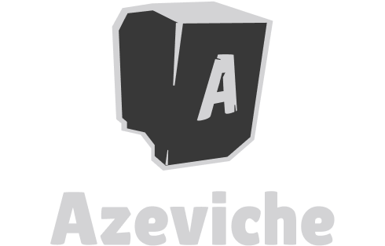

  

 

  
  

  <strong>
    Node RESTful API boilerplate  
  </strong>

  <small>
    (TypeORM + Express + TypeScript)
  </small>

## Running

Steps to run this project:

1. Run `npm i` command (install all project dependencies)
2. Setup database settings inside `data-source.ts` file
3. Run `npm start` command

## Features
- [Express](https://github.com/expressjs/express)
- [TypeORM](https://typeorm.io/)
- [JWT](https://jwt.io/) JWT authentication
- [TypeScript](https://github.com/microsoft/TypeScript)
- [ESLint](https://eslint.org/) with airbnb code pattern
- Commit messages must meet [conventional commits](https://www.conventionalcommits.org/en/v1.0.0/) format

  Maintained with ❤️ by <a href="https://github.com/tchiteu">tchiteu</a>.

